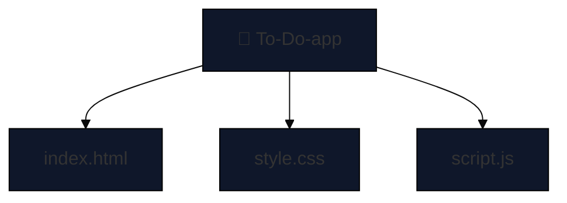

# 📝 To-Do App

&#x20; &#x20;

A browser-based To-Do List manager that helps you stay productive. Built with **HTML**, **Tailwind CSS**, and **JavaScript**, and enhanced with **GSAP animations**.

---

## 🔧 Features

- ✅ Add, complete, and delete tasks
- 🕒 Timestamp for every task
- 💾 Persistent storage using localStorage
- 💨 Smooth animations with GSAP
- 🎨 Tailwind CSS for UI styling
- ⌨️ Keyboard support (Enter to add task)

---

## 🚀 Demo

> [Live Preview](https://adytia855.github.io/To-Do-app/)

---

## 📁 Folder Structure (Mermaid)



---

## 📜 System Design

### Frontend (Client-Side)

- **HTML (index.html)**: Defines layout: input, button, task list, and footer.
- **Tailwind CSS (via CDN + style.css)**: UI styling with utility classes.
- **JavaScript (script.js)**:
  - DOM manipulation: create, update, delete tasks
  - Manages `tasks[]` array
  - Event listeners for click & Enter key
  - Saves/loads data from localStorage
- **GSAP**: Adds smooth entry/exit animations

### Data Model

```js
{
  text: "Task description",
  done: false,
  timestamp: "2025-06-20 12:30:45"
}
```

### Data Persistence

- Uses `localStorage`
- Saves `tasks[]` as a JSON string
- Restores data on page load

---

## 🔄 Workflow

### 🔹 Initialization (on Load)

- Load saved tasks from localStorage
- Parse JSON to `tasks[]`
- Render each task with GSAP

### ➕ Adding a Task

- Input field + click or Enter
- Validate input (non-empty)
- Push task to `tasks[]`
- Save and re-render with animation

### ✅ Marking as Done

- Toggle task.done on click
- Save and re-render UI

### 🗑️ Deleting a Task

- Animate with GSAP
- Remove from `tasks[]`
- Save and re-render

---

## 📦 Backend Data Flow

> Although it's frontend-only, here's how data behaves like a backend:

### LocalStorage Usage

#### Write:

```js
localStorage.setItem("tasks", JSON.stringify(tasks));
```

#### Read:

```js
const tasks = JSON.parse(localStorage.getItem("tasks")) || [];
```

---

## 💡 Inspirations & Tech

- [Tailwind CSS](https://tailwindcss.com/) – Rapid styling
- [GSAP](https://greensock.com/gsap/) – Smooth animation
- Vanilla JS – Core logic & interactivity

---

## 📥 Installation & Usage

1. Clone this repo

```bash
git clone https://github.com/Adytia855/To-Do-app.git
```

2. Open `index.html` in any browser
3. Start adding your tasks!

---

## 📄 License

This project is licensed under the MIT License.

---

## 🙋‍♂️ Author

[**Adytia855**](https://github.com/Adytia855) – beginner web developer who loves building fun and functional projects. ✨

> Give this repo a ⭐ if you liked it!

